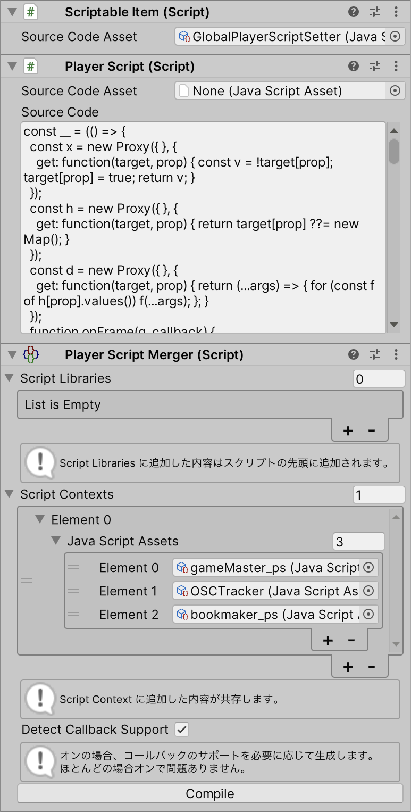

# PSMerger

[cluster](https://cluster.mu/)の[PlayerScript](https://docs.cluster.mu/script/interfaces/PlayerScript.html)や[ItemScript](https://docs.cluster.mu/script/interfaces/ClusterScript.html)をマージします。



## これは何ですか？

- 複数のPlayerScriptを同時に動かしたい時に使います
- ItemScriptやPlayerScriptのソースコードを結合したい時に使います

### ItemScript

- `onCollide()`
- `onCommentReceived()`
- `onExternalCallEnd()`
- `onGetOwnProducts()`
- `onGiftSent()`
- `onGrab()`
- `onInteract()`
- `onPhysicsUpdate()`
- `onPurchaseUpdated()`
- `onReceive()`
- `onRequestGrantProductResult()`
- `onRequestPurchaseStatus()`
- `onRide()`
- `onStart()`
- `onSteer()`
- `onSteerAdditionalAxis()`
- `onTextInput()`
- `onUpdate()`
- `onUse()`

### PlayerScript

- `onButton()`
- `onFrame()`
- `onReceive()`
- `OscHandle.onReceive()`

## インストール方法（UPM git dependency）

```json
{
  "dependencies": {
    "net.kaikoga.psmerger": "https://github.com/kaikoga/PSMerger-Unity.git"
  }
}
```

## 使用方法

### ScriptableItem にマージ

ScriptableItem に `PlayerScriptMerger` または `ItemScriptMerger` コンポーネントを追加すると、その場でマージされます。

`PlayerScriptMerger` を使う場合は、マージされたPlayerScriptがスペース内のすべてのプレイヤーに適用されるItemScriptが自動で設定されます。

### JavaScriptAsset にマージ

`Assets` -> `Create` -> `Silksprite` -> `PSMerger` -> `ClusterScriptAssetMerger`

を利用すると、マージされたスクリプトを JavaScript アセットに出力できます。
git 管理されたプロジェクトでプレハブの差分を減らしたい時に便利です。

PSMerger 2.0.0 以上で JavaScript アセットにマージした場合、 SourceMap を試験的に出力できます。

## 注意事項

PSMergerを使用する場合、一部のClusterScriptの挙動が異なります：

- `ClusterScript.onReceive()`は常に `{ item: true, player: true }` が設定されたものとして動作します。
- `ClusterScript.onPurchaseUpdated()` は他のスクリプトが `subscribePurchase()` した購入情報も受信します。
- `UnityComponent.onClick()` は共存できません。後勝ちになります。
- 他のスクリプト由来のコールバックも呼ばれるので、区別するために `meta` を活用してください。

# PSCollector

`Component` -> `Silksprite` -> `PSCollector` -> `PS Asset Collector`

がついたアイテムは、シーン内の `Merged Something List` の内容を収集して Creator Kit の `Something List` コンポーネントに出力します。
PSMerger でマージした PlayerScript の依存アイテムやアセットを設定するのに便利です。

注意: `Something List` コンポーネントの中身は上書きされます。
