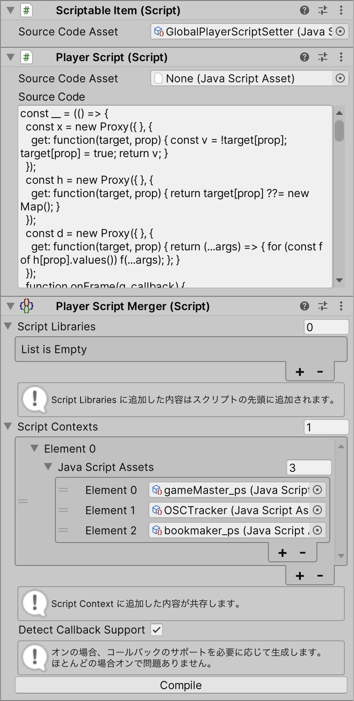

# PSMerger

A Unity package that merges [PlayerScript](https://docs.cluster.mu/script/interfaces/PlayerScript.html) and [ItemScript](https://docs.cluster.mu/script/interfaces/ClusterScript.html) callbacks from multiple input scripts in Cluster.



## What is this?

PSMerger allows you to combine multiple ItemScript or PlayerScript source files into a single script, enabling you to use multiple script functionalities simultaneously in Cluster.

### ItemScript Callbacks
- `onCollide()`
- `onCommentReceived()`
- `onExternalCallEnd()`
- `onGetOwnProducts()`
- `onGiftSent()`
- `onGrab()`
- `onInteract()`
- `onPhysicsUpdate()`
- `onPurchaseUpdated()`
- `onReceive()`
- `onRequestGrantProductResult()`
- `onRequestPurchaseStatus()`
- `onRide()`
- `onStart()`
- `onSteer()`
- `onSteerAdditionalAxis()`
- `onTextInput()`
- `onUpdate()`
- `onUse()`

### PlayerScript Callbacks
- `onButton()`
- `onFrame()`
- `onReceive()`
- `OscHandle.onReceive()`

## Installation

Add the following to your `Packages/manifest.json`:

```json
{
  "dependencies": {
    "net.kaikoga.psmerger": "https://github.com/kaikoga/PSMerger-Unity.git"
  }
}
```

## Important Notes

When using PSMerger, there are some behavioral differences from standard Cluster scripting:

- `ClusterScript.onReceive()` receives messages from both ItemHandle and PlayerHandle regardless of the second parameter
- `ClusterScript.onPurchaseUpdated()` receives all subscribed purchases from all input scripts
- `UnityComponent.onClick()` registrations are not merged - only the last registration takes effect
- API call responses are broadcast to all input scripts - use the `meta` parameter to filter responses
